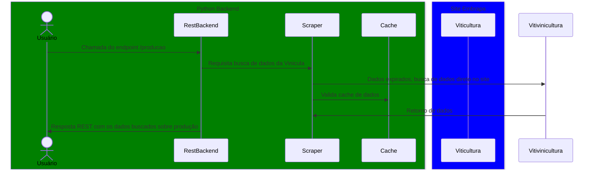

# Projeto Viniculas - Tech Challenge Fiap

**O Projeto segue a seguinte arquitetura:**

/app - raiz do projeto
- /api - endpoint que podem ser acessados externamente
- /datasource - acesso a dados externos e banco de dados
- /security - controle de acesso e geração de token de segurança
- /infra - infraestrutura e utilitários do sistema


## Arquitetura da aplicação

O projeto segue um arquitetura simples, temos um aplicativo backend consistem em uma API REST que contem um Scraper.
O site alvo da é o da embrapa.
E por fim o banco de dados que armazena as buscas do scraper.


## Gráfico de fluxo de acesso da aplicação


## Execução do Sistema

O sistema funciona com os seguintes comandos:

**Build da imagem docker**
```bash
sudo DOCKER_BUILDKIT=1 docker-compose build
```

**Execução da imagem**
```bash
sudo docker-compose up -d
```
