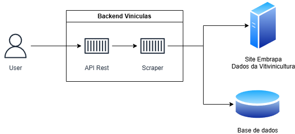
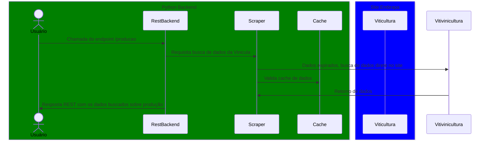

# Projeto Viniculas - Tech Challenge Fiap
Uma API construída com **FastAPI** que realiza a raspagem de dados tabulares do site da [EMBRAPA - Viticultura e Enologia](http://vitibrasil.cnpuv.embrapa.br/), com autenticação via **JWT**, persistência em banco de dados (PostgreSQL ou SQLite como fallback) e cache local via `diskcache`.

**O Projeto segue a seguinte arquitetura:**

/app - raiz do projeto
- /api - endpoint que podem ser acessados externamente
- /datasource - acesso a dados externos e banco de dados
- /security - controle de acesso e geração de token de segurança
- /infra - infraestrutura e utilitários do sistema


## Arquitetura da aplicação

O projeto segue um arquitetura simples, temos um aplicativo backend consistem em uma API REST que contem um Scraper.
O site alvo da é o da embrapa.
E por fim o banco de dados que armazena as buscas do scraper.



## Gráfico de fluxo de acesso da aplicação


## Execução do Sistema

O sistema funciona com os seguintes comandos:

**Build da imagem docker**
```bash
sudo DOCKER_BUILDKIT=1 docker-compose build
```

**Execução da imagem**
```bash
sudo docker-compose up -d
```

## Instruções de Uso

## Autenticação

A autenticação é feita via **JWT Bearer Token**.

### `POST /login`

Realiza o login e retorna o token.

**Body (x-www-form-urlencoded):**

```txt
username: admin
password: admin123
```

**Response:**

```json
{
  "access_token": "eyJhbGciOiJIUzI1NiIsInR5...",
  "token_type": "bearer"
}
```

### `POST /signin`

Cria um novo usuário.

**Body (x-www-form-urlencoded):**

```txt
user: novo_usuario
passw: senha123
```

---

## Endpoints

### `GET /tabelas/disponiveis`

Retorna as tabelas salvas no banco.

---

### `GET /tabelas`

Consulta tabelas do site da Embrapa em determinado intervalo de anos.

**Parâmetros obrigatórios:**

- `ano_inicio`: int
- `ano_fim`: int
- `opcao`: categoria da tabela
- `subopcao`: subtipo (opcional)
- `intervalo`: delay entre requisições (default: 1.5 segundos)

---

## Opções de Consultas Disponíveis

Abaixo estão listadas as opções de consultas disponíveis na API, organizadas por código (`opt_xx`) e suas respectivas subopções, quando aplicável:

### `ano inicial && ano_final`
Anos disponíveis para consulta via API
**Dados fornecidos de 1970 a 2023**.

### `opt_02` – Produção
Consulta os dados de **produção**.  
**Não possui subopções**.

### `opt_03` – Processamento
Consulta dados de **processamento** conforme a classificação das uvas:
- `subopt_01` – Viníferas  
- `subopt_02` – Americanas e Híbridas  
- `subopt_03` – Uvas de Mesa  
- `subopt_04` – Sem Classificação  

### `opt_04` – Comercialização
Consulta os dados de **comercialização**.  
**Não possui subopções**.

### `opt_05` – Importação
Consulta dados de **importação** segmentados por tipo de produto:
- `subopt_01` – Vinho de Mesa  
- `subopt_02` – Espumantes  
- `subopt_03` – Uvas Frescas  
- `subopt_04` – Uvas Passas  
- `subopt_05` – Suco de Uva  

### `opt_06` – Exportação
Consulta dados de **exportação** segmentados por tipo de produto:
- `subopt_01` – Vinhos de Mesa  
- `subopt_02` – Espumantes  
- `subopt_03` – Uvas Frescas  
- `subopt_04` – Suco de Uva  


**Exemplo:**

```curl -X 'GET' \
  'https://mlet-api-embrapa-1.onrender.com/tabelas?ano_inicio=2020&ano_fim=2022&opcao=opt_03&subopcao=subopt_02&intervalo=1.5' \
  -H 'accept: application/json
```
## Armazenamento

- Tabelas raspadas são salvas no PostgreSQL (ou SQLite como fallback).
- Cache local disponível com `diskcache` para acelerar acessos.

---

## Licença

Este projeto é livre para fins educacionais e acadêmicos. Sinta-se à vontade para modificar conforme sua necessidade.
