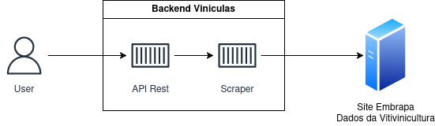
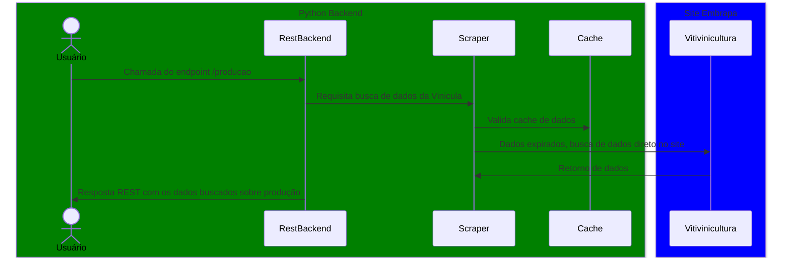

Projeto Viniculas - Tech Challenge Fiap

O Projeto segue a seguinte arquitetura:
/app - raiz do projeto
- /api - endpoint que podem ser acessados externamente
- /cache - cache de dados
- /datasource - acesso a dados externos e banco de dados
- /security - controle de acesso e geração de token de segurança

## Arquitetura da aplicação

## Gráfico de fluxo de acesso da aplicação

Buildar imagem com "sudo DOCKER_BUILDKIT=1 docker-compose build"
Executar imagem com "sudo docker-compose up -d"